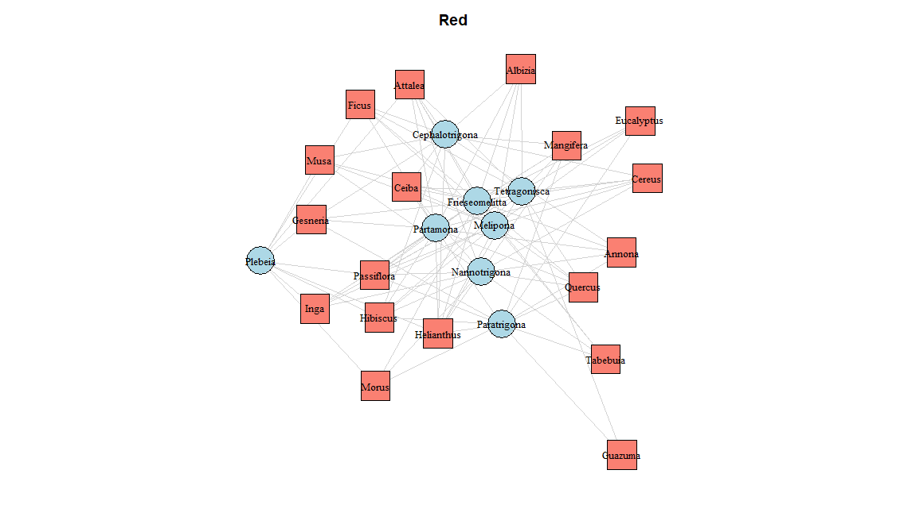
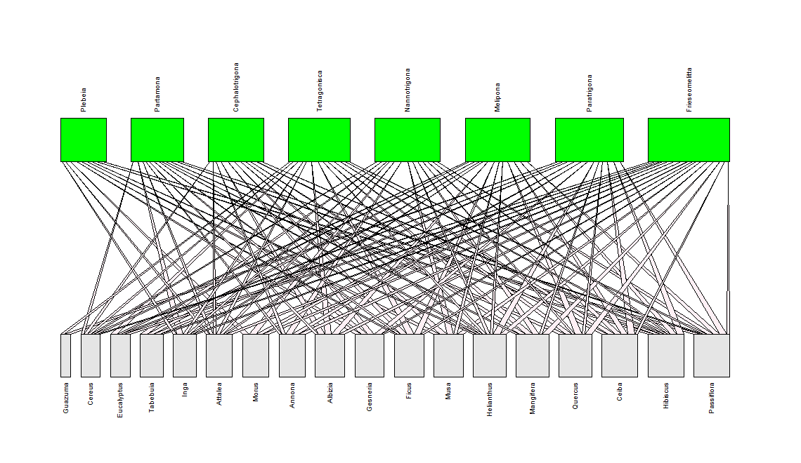

## Plant–Bee Interaction Network Analysis

This repository contains a modified exercise from the course **“Análisis de redes de Interacción”**, held as part of the VI National Congress of Zoology of the Colombian Association of Zoology.  
**Modified by:** Brian Hincapie

---

## Overview

We analyze a bipartite network of plant–bee interactions, compute network‑level indices, and explore modular structure.

---
## Create data set

    # interaction_data <- data.frame( Plant = c("Albizia", "Ceiba", "Cereus", "Gesneria", "Hibiscus", "Inga", "Passiflora", "Annona", "Musa"),
    Tetragonisca   = c(2, 2, 1, 0, 1, 1, 0, 0, 0),
    Nannotrigona   = c(0, 2, 1, 0, 1, 1, 1, 2, 2),
    Melipona       = c(2, 2, 1, 0, 2, 1, 0, 1, 2),
    Cephalotrigona = c(2, 2, 1, 2, 1, 0, 0, 2, 1),
    Plebeia        = c(0, 0, 0, 2, 2, 1, 2, 0, 0),
    Paratrigona    = c(0, 2, 0, 2, 2, 0, 1, 1, 1),
    Frieseomelitta = c(2, 1, 1, 1, 0, 2, 2, 0, 0),
    Partamona      = c(1, 0, 1, 2, 2, 0, 1, 1, 1)
    )

## Analysis Script

    # 1. Load required packages (install if needed)
    install.packages(c("readxl", "bipartite", "igraph", "openxlsx"))  # run once if you haven't
    library(readxl)
    library(bipartite)
    library(igraph)
    library(openxlsx)

    # 2. Load interaction matrix from Excel
    file_path <- "data/plant_bee_interactions.xlsx"
    df <- read_excel(file_path, col_names = TRUE)

    # 3. Convert to matrix and set row names
    m <- as.matrix(df[, -1])       # all columns except first
    rownames(m) <- df[[1]]         # first column is 'Plant'

    # 4. Bipartite network plotting with bipartite::plotweb
    plotweb(
      sortweb(m, sort.order = "inc"),
      method          = "normal",
      arrow           = "up",
      ybig            = 1.1,
      text.rot        = 90,
      col.high        = "#00FF00",
      col.low         = "gray90",
      col.interaction = "#FFF0F5"
    )

    # 5. Build igraph object for further network analysis
    g <- graph.incidence(m, weighted = TRUE)
    stopifnot(is.bipartite(g))

    # 6. Assign basic visual attributes
    V(g)$color <- ifelse(V(g)$type, "lightblue", "salmon")
    V(g)$shape <- ifelse(V(g)$type, "circle", "square")
    E(g)$color <- "lightgray"

    # 7. Plot igraph representation (original)
    plot(
      g,
      layout           = layout_as_bipartite,
      vertex.size      = 5,
      vertex.label.cex = 0.7,
      vertex.label.color = "black",
      main             = "Plant–Bee Bipartite Network"
    )

    # 8. Additional igraph-based plots
    tdf <- table(m)                              # frequency table
    colrs <- c("green", "cyan")[V(g)$type + 1L]
    plot(g, vertex.color = colrs, layout = layout_as_bipartite, main = "Colored by Type")
    plot(g, vertex.label.cex = 0.8, vertex.label.color = "black", main = "Labels Only")

    V(g)$frame.color <- "gray"
    V(g)$size        <- 10
    V(g)$label.cex   <- 0.5
    plot(g, layout = layout_with_graphopt, main = "Custom Shapes & Size")

    plot(g, layout = layout.bipartite, vertex.size = 8, vertex.label.cex = 0.2, main = "Bipartite Layout (Sized)")

    V(g)$size      <- degree(g)
    V(g)$label.cex <- degree(g) * 0.2
    plot(g, layout = layout_with_graphopt, main = "Size & Label Scaled by Degree")

    # 9. Calculate network‐level indices
    deg  <- networklevel(m, index = 'connectance')
    nodf <- networklevel(m, index = 'weighted NODF')

    # 10. Save indices to Excel
    dir.create("results", showWarnings = FALSE)
    indices <- data.frame(Connectance = deg, Nestedness = nodf)
    write.xlsx(indices, file = "results/network_indices.xlsx", rowNames = FALSE)

    # 11. Modular analysis with bipartite
    mod <- computeModules(web = m, steps = 100)
    plotModuleWeb(mod)
    printModuleInformation(mod)

    # 12. Null model test for modularity significance
    nulls        <- nullmodel(m, N = 100, method = "r2dtable")
    modules_null <- lapply(nulls, computeModules)
    likelihoods  <- sapply(modules_null, function(x) x@likelihood)
    z_score      <- (mod@likelihood - mean(likelihoods)) / sd(likelihoods)

    cat("Modularity likelihood:", mod@likelihood, "\n")
    cat("Null mean:", mean(likelihoods), "Null sd:", sd(likelihoods), "\n")
    cat("Z-score for modularity:", round(z_score, 3), "\n")

---

## Requirements

- **R** (≥ 4.0)  
- Install packages with:

        install.packages(c("readxl", "bipartite", "igraph", "openxlsx"))

---

## Results

  
  

